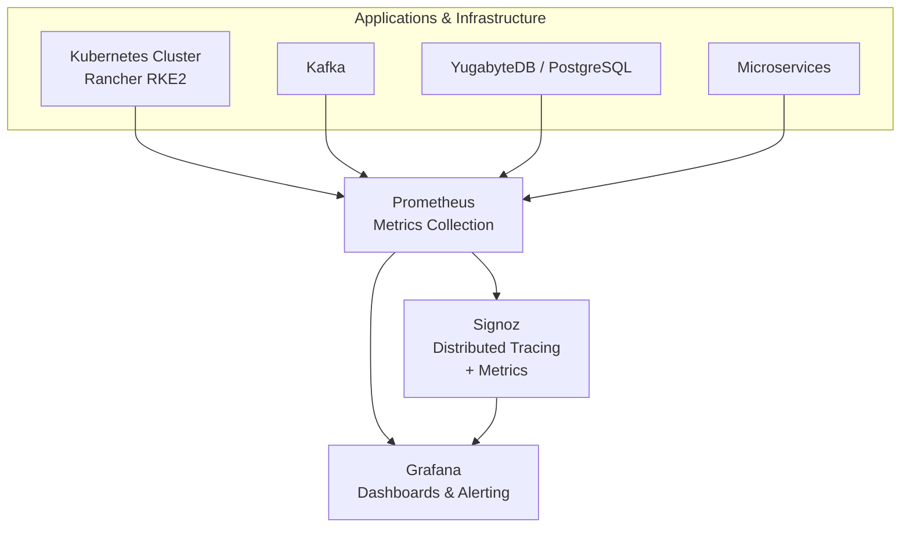

# DevOps Monitoring & Observability Stack

Production-ready monitoring and observability setup using **Prometheus**, **Grafana**, and **Signoz**.  
This stack is similar to what I have implemented for banking systems and government health facilities in Ethiopia to achieve real-time visibility and faster incident response.

### What This Demonstrates
- Metrics collection with Prometheus
- Beautiful dashboards and alerting with Grafana
- Distributed tracing with Signoz (OpenTelemetry compatible)
- Monitoring of Kubernetes clusters, Kafka, databases, and microservices
- Alerting rules for high CPU, memory, disk, and service downtime

### Tech Stack
- Prometheus
- Grafana
- Signoz
- Docker / Docker Compose
- Kubernetes (ready for deployment)
- Alertmanager (basic integration)

### Files Included
- `docker-compose.yml` — Quick local testing environment
- `prometheus.yml` — Scrape configurations + alerting rules
- `alert.rules.yml` — Sample alerting rules
- `dashboards/` — Sample Grafana dashboard JSON files
- `architecture.md` — Visual architecture diagram

### Quick Start (Local Testing)
```bash
docker-compose up -d
```

### Check it on your browser
Prometheus
```bash
http://localhost:9090
```
Grafana
```bash
http://localhost:3000
# (default login: admin / admin)
```
## Real-World Usage
I have used similar observability stacks to monitor production Kubernetes clusters running Kafka, YugabyteDB, PostgreSQL, and critical banking/health applications. This setup helped significantly reduce Mean Time To Resolution (MTTR) by providing clear visibility into infrastructure and application performance.

## Architecture Overview

