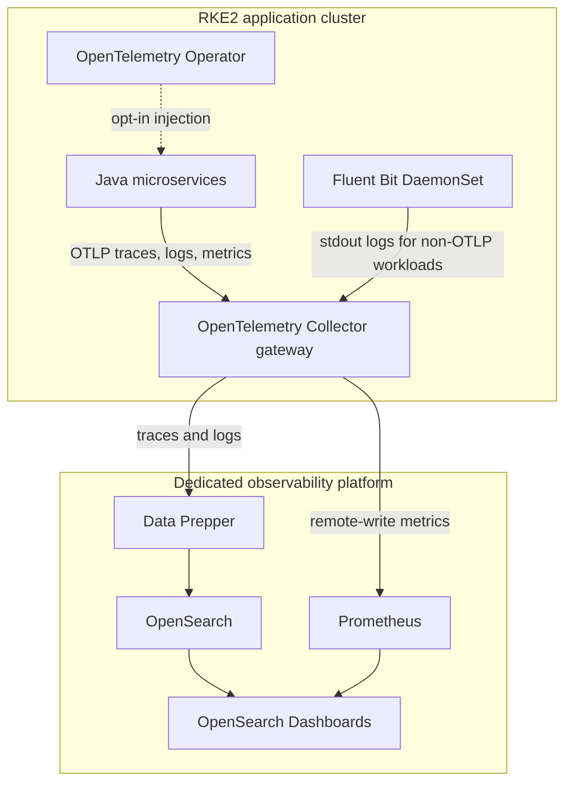

# OpenSearch Observability Platform for RKE2

A version-pinned, progressively validated observability platform for RKE2 and Java microservices. The design targets banking environments with large Kubernetes application fleets while keeping the stateful observability services outside the application cluster.

This implementation replaces the repository's former SigNoz/Grafana experiment. **SigNoz and Grafana are not components of this implementation.**

## Current stack

| Layer | Component | Validated version | Responsibility |
|---|---|---:|---|
| Application | OpenTelemetry Java agent | 2.28.1 | Automatic traces, correlated logs, and runtime/application metrics |
| Kubernetes | OpenTelemetry Operator | 0.154.0 | Opt-in agent injection for agentless images |
| Kubernetes | OpenTelemetry Collector Contrib | 0.156.0 | OTLP gateway, Kubernetes enrichment, and signal routing |
| Kubernetes | Fluent Bit | 4.1.0 | Container stdout collection for workloads not exporting OTLP logs |
| Processing | Data Prepper | 2.14.1 | Trace/log ingestion and v2 service-map generation |
| Metrics | Prometheus | 3.10.0 lab; 3.13.2 LTS production target | Metrics storage, RED rules, SLO calculations, and reporting metrics |
| Storage and UI | OpenSearch and OpenSearch Dashboards | 3.7.0 | Logs, traces, application maps, dashboards, and investigation |
| Platform | RKE2 / Kubernetes | v1.35.7+rke2r1 / v1.35.7 | Application orchestration |

See [Version and Lifecycle Policy](docs/01-version-policy.md) for the selection rules and production promotion process.

## Architecture


```mermaid
flowchart TB
    subgraph RKE2["RKE2 application cluster"]
        Apps["Java microservices"]
        FB["Fluent Bit DaemonSet"]
        Operator["OpenTelemetry Operator"]
        Collector["OpenTelemetry Collector gateway"]

        Operator -. "opt-in injection" .-> Apps
        Apps -->|"OTLP traces, logs, metrics"| Collector
        FB -->|"stdout logs for non-OTLP workloads"| Collector
    end

    subgraph OBS["Dedicated observability platform"]
        DP["Data Prepper"]
        Prom["Prometheus"]
        OS["OpenSearch"]
        UI["OpenSearch Dashboards"]

        DP --> OS
        OS --> UI
        Prom --> UI
    end

    Collector -->|"traces and logs"| DP
    Collector -->|"remote-write metrics"| Prom
```

OpenSearch, OpenSearch Dashboards, Data Prepper, and Prometheus run on dedicated observability infrastructure. The Operator and Collector run once per Kubernetes cluster—not once per application or node.

For the production topology, failure domains, scaling boundaries, and network flows, read [Scalable Observability Architecture](docs/02-architecture.md).

## Instrumentation modes

Every Java container must run exactly one OpenTelemetry Java agent.

| Application image | Mode | Rule |
|---|---|---|
| Already starts with `-javaagent` | Embedded agent | Configure OTLP environment; never add Operator injection |
| Contains no agent | Operator injection | Add the explicit `inject-java` annotation |

Applications exporting logs directly through OTLP use `fluentbit.io/exclude: "true"` to prevent Fluent Bit from sending an uncorrelated duplicate.

See [Kubernetes Telemetry Onboarding](docs/05-kubernetes-telemetry-onboarding.md) for both manifests, the double-agent guardrail, validation, and rollback.

## Repository layout

```text
.
├── compose.yaml                         # Single-node OpenSearch lab only
├── dashboards/                         # OpenSearch Dashboards export policy
├── docs/
│   ├── 01-version-policy.md
│   ├── 02-architecture.md
│   ├── 03-infrastructure-prerequisites.md
│   ├── 04-lab-preflight-validation.md
│   ├── 05-kubernetes-telemetry-onboarding.md
│   ├── 06-observability-host-bootstrap.md
│   └── 07-validation-and-evidence.md
├── evidence/                           # Evidence policy; generated output stays local
├── kubernetes/
│   ├── collector/                       # Collector, Service, RBAC, and configuration
│   ├── examples/                        # Mutually exclusive Java onboarding modes
│   ├── instrumentation/                 # Shared opt-in Instrumentation resource
│   └── operator/                        # Pinned Operator Helm values
├── prometheus/
│   └── rules/                           # Platform alerts, RED, SLO, and report rules
├── scripts/
│   └── validate-platform.sh             # Read-only end-to-end acceptance checks
├── prometheus.yml                       # Remote-write receiver and local scrape baseline
└── versions.env                         # Frozen component baseline
```

## Validated results

The functional lab has demonstrated:

- stable RKE2 operation through a five-minute validation window;
- a healthy, pinned Operator and Collector;
- least-privilege Collector Kubernetes RBAC;
- Kubernetes metadata enrichment across traces, logs, and metrics;
- a gateway-to-payment distributed trace and v2 service-map relationship;
- trace- and span-correlated application logs;
- duplicate-log prevention between OTLP and Fluent Bit;
- automatic Prometheus reporting discovery for newly instrumented services;
- request, 4xx, 5xx, latency, availability, and error-budget calculations.

This is a validated functional baseline, not a claim that the single-node lab topology is production ready.

## Documentation path

Read the repository in this order:

1. [Version and Lifecycle Policy](docs/01-version-policy.md)
2. [Scalable Observability Architecture](docs/02-architecture.md)
3. [Infrastructure Prerequisites](docs/03-infrastructure-prerequisites.md)
4. [Lab Preflight Validation](docs/04-lab-preflight-validation.md)
5. [Kubernetes Telemetry Onboarding](docs/05-kubernetes-telemetry-onboarding.md)
6. [Dedicated Observability Host Bootstrap](docs/06-observability-host-bootstrap.md)
7. [Validation and Evidence](docs/07-validation-and-evidence.md)

## Lab-only OpenSearch start

The root [compose.yaml](compose.yaml) starts only OpenSearch and OpenSearch Dashboards for single-node functional testing. It is not the production deployment method.

```bash
export OPENSEARCH_INITIAL_ADMIN_PASSWORD='replace-with-a-strong-random-secret'
docker compose config
docker compose up -d
```

Do not store the password in Git or shell history in a real environment. Data Prepper and Prometheus are managed separately in the validated lab and will receive their own sanitized installation stages.

## Production gates still open

Before production promotion, the project still requires:

- Collector gateway high availability and capacity tests;
- authenticated TLS or mTLS for every cross-host telemetry path;
- Kubernetes NetworkPolicies and host firewall rules;
- external secret management and credential rotation;
- OpenSearch multi-node sizing, retention, snapshots, and recovery testing;
- Prometheus LTS upgrade validation, retention, backup, and HA decision;
- alert routing, notification ownership, and runbooks;
- UAT soak, failure, and rollback tests at representative application scale.

## Security

This public repository must never contain production addresses, hostnames, usernames, passwords, tokens, certificates, kubeconfigs, trace IDs, transaction IDs, or customer data. Environment-specific values belong in private overlays or an approved secrets manager.
