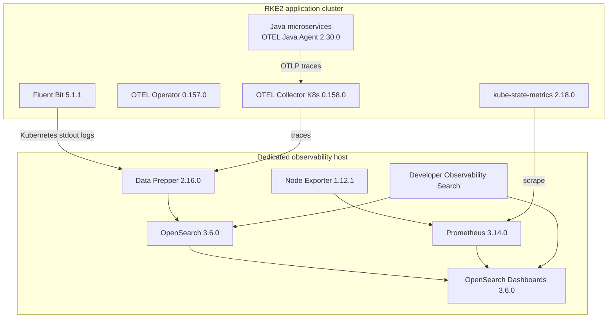

# OpenSearch Observability Platform for RKE2

A version-pinned, progressively validated observability platform for RKE2 and Java microservices. The design targets banking environments with large Kubernetes application fleets while keeping the stateful observability services outside the application cluster.

This implementation replaces the repository's former SigNoz/Grafana experiment. **SigNoz and Grafana are not components of the current validated platform.**

## Current validated UAT2 stack

| Layer | Component | Verified version | Responsibility |
|---|---|---:|---|
| Application | OpenTelemetry Java agent | 2.30.0 | Automatic distributed tracing and trace/span context propagation |
| Kubernetes | OpenTelemetry Operator | 0.157.0 | Cluster-level instrumentation management |
| Kubernetes | OpenTelemetry Collector K8s | 0.158.0 | OTLP gateway, Kubernetes enrichment, and telemetry routing |
| Kubernetes | Fluent Bit | 5.1.1 | Container stdout collection and Kubernetes log forwarding |
| Processing | Data Prepper | 2.16.0 | Trace/log ingestion, parsing, normalization, and service-map processing |
| Metrics | Prometheus | 3.14.0 | Metrics storage, PromQL, RED/SLO inputs, and monitoring APIs |
| Metrics | Node Exporter | 1.12.1 | Host metrics |
| Metrics | kube-state-metrics | v2.18.0 | Kubernetes object/state metrics |
| Storage and UI | OpenSearch / OpenSearch Dashboards | 3.6.0 | Logs, traces, dashboards, service maps, and investigation |
| Search engine | Lucene | 10.4.0 | OpenSearch indexing/search engine |
| Platform | RKE2 / Kubernetes | v1.34.5+rke2r1 / v1.34.5 | Application orchestration |

The exact machine-verified baseline is recorded in [`versions.env`](versions.env).

## Architecture


```mermaid
flowchart TB
    subgraph RKE2["RKE2 application cluster"]
        Apps["Java microservices\nOTEL Java Agent 2.30.0"]
        FB["Fluent Bit 5.1.1"]
        Operator["OTEL Operator 0.157.0"]
        Collector["OTEL Collector K8s 0.158.0"]
        KSM["kube-state-metrics 2.18.0"]
    end

    subgraph OBS["Dedicated observability host"]
        DP["Data Prepper 2.16.0"]
        Prom["Prometheus 3.14.0"]
        Node["Node Exporter 1.12.1"]
        OS["OpenSearch 3.6.0"]
        UI["OpenSearch Dashboards 3.6.0"]
        DevSearch["Developer Observability Search"]

        DP --> OS
        OS --> UI
        Prom --> UI
        Node --> Prom
        DevSearch --> OS
        DevSearch --> UI
    end

    Apps -->|"OTLP traces"| Collector
    FB -->|"Kubernetes stdout logs"| DP
    Collector -->|"traces"| DP
    KSM -->|"scrape"| Prom
```

OpenSearch, OpenSearch Dashboards, Data Prepper, Prometheus, Node Exporter, and the developer-search helper run on dedicated observability infrastructure. The OpenTelemetry Operator, Collector, Fluent Bit, and kube-state-metrics run in RKE2.

## What has been validated

The UAT2 implementation has demonstrated:

- OpenTelemetry Java agent 2.30.0 running consistently across instrumented Java services;
- distributed trace propagation across HTTP services and Kafka producer/consumer boundaries;
- stable traceId propagation with changing spanId and correct parentSpanId relationships;
- Kubernetes-enriched traces through the central Collector;
- centralized container logs through Fluent Bit and Data Prepper;
- Data Prepper parsing and normalization for structured trace/span fields;
- additive business-correlation normalization using existing application data without inventing trace IDs;
- ANSI terminal escape removal from newly ingested log messages;
- OpenSearch log and trace retention policies attached and healthy;
- Prometheus host/Kubernetes metrics collection;
- OpenSearch Dashboards workspaces and developer-investigation dashboards;
- a custom developer search interface for endpoint, trace, phone/account-assisted correlation, and broad log search;
- trace-based navigation from business identifiers when a real correlated traceId exists.

## Correlation model

A business identifier is a lookup key, not a replacement for distributed tracing.

```text
phone/account/endpoint
        |
        v
structured log/trace attributes
        |
        v
real OpenTelemetry traceId
        |
        +--> full distributed trace
        +--> correlated logs
```

The platform never manufactures trace IDs. If a service emits logs without trace context, those logs remain searchable but cannot be presented as part of a distributed trace until the service is instrumented.

## Repository layout

```text
.
├── compose.yaml
├── dashboards/
├── docs/
│   ├── 01-version-policy.md
│   ├── 02-architecture.md
│   ├── 03-infrastructure-prerequisites.md
│   ├── 04-lab-preflight-validation.md
│   ├── 05-kubernetes-telemetry-onboarding.md
│   ├── 06-observability-host-bootstrap.md
│   ├── 07-validation-and-evidence.md
│   └── 08-uat2-implementation-status.md
├── evidence/
├── kubernetes/
│   ├── collector/
│   ├── examples/
│   ├── instrumentation/
│   └── operator/
├── prometheus/
│   └── rules/
├── scripts/
│   └── validate-platform.sh
├── prometheus.yml
└── versions.env
```

## Next hardening phase

Before production promotion, the remaining focus is:

1. **RBAC and access control** — OpenSearch/OpenSearch Dashboards roles, least-privilege workspace/data access, service credentials, and admin separation.
2. **Alerting** — infrastructure, Kubernetes, ingestion, OpenSearch capacity, application RED/SLO, and pipeline-failure alerts with ownership and runbooks.
3. **Tuning and capacity** — OpenSearch heap/shards/storage, Data Prepper buffers/batches, Prometheus retention and memory, Collector resources, Fluent Bit buffering, and representative load testing.
4. **Security hardening** — TLS/authentication on cross-host telemetry paths, NetworkPolicies/firewalls, secret management, and credential rotation.
5. **Recovery** — snapshots/backups, restore validation, retention verification after indices actually cross their delete threshold, and documented rollback procedures.

## Security and publication policy

This public repository must never contain internal addresses, hostnames, usernames, passwords, tokens, certificates, kubeconfigs, customer phone/account values, transaction IDs, or real production traces. Environment-specific values belong in private overlays or an approved secrets manager.

The repository uses sanitized examples and version/documentation evidence only.
