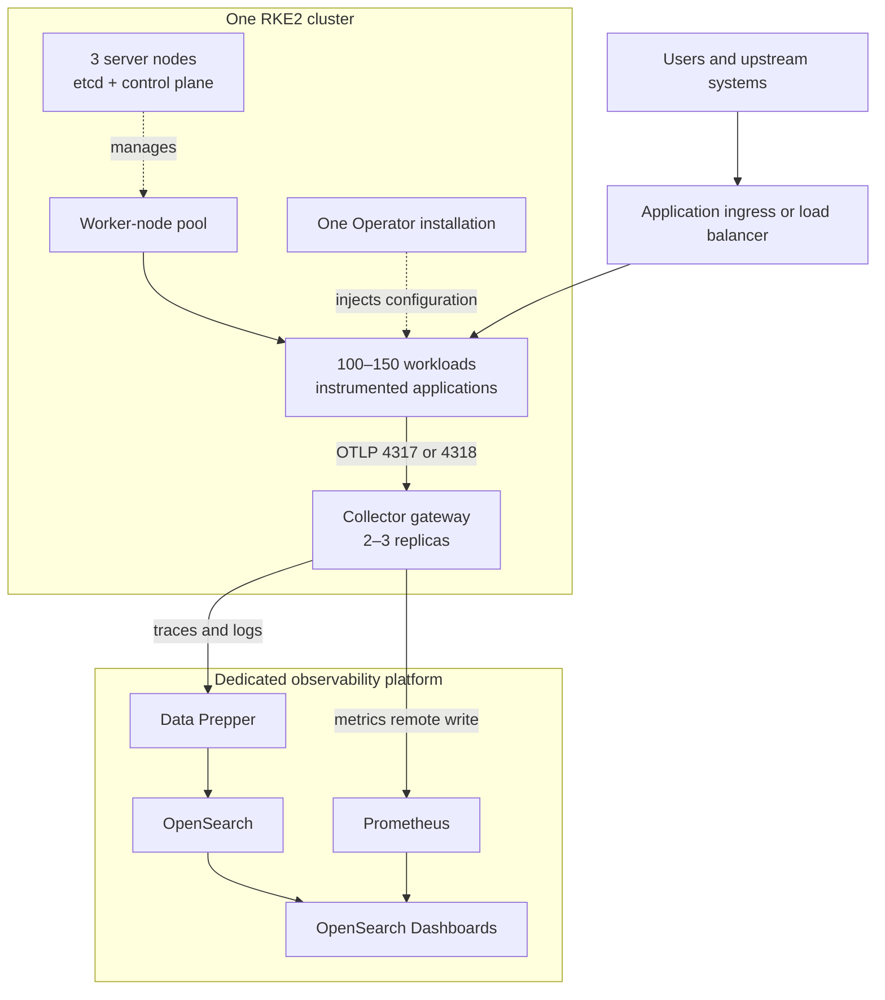

# Scalable Observability Architecture

**Architecture type:** One RKE2 cluster with multiple nodes and a separate observability platform  
**Target scale:** Approximately 100–150 Kubernetes workloads  
**Design principle:** Configure the platform once, then onboard services through controlled namespace or workload policy.

## 1. Clarifying the topology

There is **one RKE2 cluster**, not one cluster per node.

The cluster contains:

- three RKE2 server nodes in production for the Kubernetes API, control plane, and embedded etcd;
- multiple RKE2 worker nodes for application workloads and observability collection components;
- one cluster-wide OpenTelemetry Operator installation;
- a horizontally scalable OpenTelemetry Collector gateway;
- optional node-level collectors for file logs and host telemetry.

OpenSearch and its supporting services run outside the RKE2 cluster on the dedicated observability platform. Rancher is the cluster-management interface; the Operator is installed into RKE2 through Helm or Rancher, not “on Rancher” as a separate machine.

## 2. Production logical architecture

The observability system is not part of the business request path. If the observability platform is unavailable, application transactions must continue. Telemetry exporters use bounded queues, timeouts, retries, and non-blocking behavior.

## 3. Component placement

| Component | Deployment scope | Preferred placement | Primary responsibility |
|---|---|---|---|
| Rancher | Management platform | Existing management location | Cluster lifecycle and UI |
| RKE2 server | Three replicas | Dedicated server/control-plane nodes | API, scheduler, controllers, etcd |
| Application workloads | Many replicas | Worker nodes | Business services |
| OpenTelemetry Operator | One installation per cluster | Worker nodes | Manages Instrumentation and Collector resources; injects agents |
| Operator replicas | One in lab; production HA where validated | Separate worker nodes | Admission webhook and reconciliation |
| Collector gateway | Deployment, 2–3 production replicas | Separate worker nodes | Receives OTLP, enriches, batches, filters, samples, and exports |
| Node telemetry agent | Optional DaemonSet | One per eligible worker | Reads node-local logs and host telemetry |
| Fluent Bit | Existing DaemonSet, if retained | One per worker | Kubernetes container log collection |
| Data Prepper | Platform service | Dedicated observability host(s) | Trace/log processing and service-map generation |
| Prometheus | Platform service | Dedicated observability host(s) | Metrics storage, RED rules, SLO calculations |
| OpenSearch | Stateful platform | Dedicated observability host(s) | Trace, log, and service-map storage |
| OpenSearch Dashboards | Platform service | Dedicated observability host(s) | APM, search, dashboards, and reporting |

## 4. Telemetry flows

### Traces

1. The Operator injects the pinned OpenTelemetry Java agent into eligible application pods.
2. The agent creates server, client, database, messaging, and application spans.
3. Trace context is propagated between services.
4. Pods send OTLP to the in-cluster Collector Service.
5. Collector gateways add Kubernetes metadata and export to Data Prepper.
6. Data Prepper writes spans and service-map documents to OpenSearch.
7. Dashboards displays services, operations, dependencies, and trace details.

### Metrics

1. Application agents produce runtime and HTTP metrics.
2. Collectors receive OTLP metrics and scrape approved cluster targets.
3. Resource attributes are converted to stable Prometheus labels.
4. Collectors remote-write metrics to Prometheus.
5. Generic recording rules calculate request, error, fault, latency, availability, and error-budget values by service and environment.
6. A reusable dashboard selects any discovered service without creating service-specific rules.

### Logs

Two collection methods are supported, but ownership must be explicit:

- **Application OTLP logs:** the Java agent sends structured logs through the Collector.
- **Container file logs:** Fluent Bit or an OpenTelemetry node agent tails Kubernetes container logs.

Both paths must preserve or enrich:

- `service.name`;
- `service.namespace`;
- `deployment.environment.name`;
- `trace_id` and `span_id`;
- Kubernetes namespace, pod, container, node, and workload metadata.

A log record must not be collected twice by both paths.

## 5. Configure-once onboarding model

The platform is installed once per cluster. Applications are onboarded through reusable policy:

1. Deploy one pinned `Instrumentation` custom resource for each supported runtime and environment.
2. Point instrumentation to the in-cluster Collector Service.
3. Apply injection only to approved namespaces or workload templates.
4. Standardize Kubernetes labels for application name, version, owner, and environment.
5. Roll out workloads so the admission webhook can inject the agent.
6. Confirm the service appears automatically in traces, metrics, logs, and reports.

Recommended policy is **opt-in by namespace**, with explicit exclusions for:

- `kube-system`;
- Rancher and RKE2 system namespaces;
- databases and infrastructure that use native exporters;
- jobs where instrumentation overhead is not justified;
- workloads that already embed an OpenTelemetry agent.

## 6. Instrumentation safety

An application must use exactly one Java instrumentation method:

| Existing application state | Operator injection |
|---|---|
| Image already contains `-javaagent` | Disabled |
| Clean Java image without agent | Enabled |
| Application uses manual OpenTelemetry SDK | Reviewed before injection |
| Non-Java application | Use the matching runtime instrumentation or manual SDK |

The current bank-demo images contain the Java agent. They must be rebuilt without the embedded agent before testing Operator-based injection. Injecting a second Java agent can cause duplicate telemetry, increased memory consumption, startup failures, or unsupported behavior.

## 7. Kubernetes metadata and RBAC

The Collector must use a dedicated ServiceAccount rather than the namespace default account.

Required design:

- least-privilege ClusterRole for reading pods, namespaces, nodes, replicasets, deployments, statefulsets, daemonsets, and jobs as required;
- ClusterRoleBinding only for the Collector ServiceAccount;
- `k8sattributes` processor applied consistently to traces, metrics, and logs;
- workload and pod association rules validated against RKE2 networking;
- no Kubernetes write permissions for telemetry collection.

The Operator uses its chart-managed RBAC for CRD reconciliation and admission webhooks. Operator permissions and Collector permissions remain separate.

## 8. Scheduling and high availability

### Production RKE2 cluster

- General application workloads, Operator pods, and Collectors run on worker nodes.
- Server/control-plane nodes remain tainted and reserved for cluster management.
- Collector replicas use pod anti-affinity or topology-spread constraints.
- A PodDisruptionBudget protects Collector availability during maintenance.
- Resource requests are mandatory; limits are introduced after observed usage is understood.
- Horizontal scaling is based on CPU, memory, receiver refusal, queue utilization, exporter failures, and telemetry volume.

### Single-node lab

The lab node performs both server and worker roles. It can validate configuration and end-to-end telemetry, but it cannot validate:

- node failure;
- replica placement across failure domains;
- control-plane isolation;
- PodDisruptionBudget effectiveness;
- real multi-node network behavior;
- production ingestion capacity.

The lab mimics the logical architecture, not production high availability.

## 9. Failure behavior

| Failure | Expected application impact | Telemetry impact | Recovery control |
|---|---|---|---|
| Operator unavailable | Existing pods continue running | Existing agents continue exporting; new injection/reconciliation pauses | Restart Operator; webhook monitoring |
| One Collector replica fails | None | Service routes to remaining replicas | Multiple replicas, probes, PDB |
| All Collectors unavailable | None | Bounded agent queues retry; excess telemetry may be dropped | Restore Collectors; alert on refused/export-failed telemetry |
| Data Prepper unavailable | None | Collector export queues and retries; eventual drops if outage exceeds capacity | Persistent/bounded queue where supported; restore pipeline |
| Prometheus unavailable | None | Metric remote write retries; reporting temporarily stale | Restore Prometheus and storage |
| OpenSearch unavailable | None | Trace/log ingestion pauses; queues may eventually overflow | Snapshots, monitoring, documented recovery |
| Dedicated observability host fails | None | The full monitoring platform becomes unavailable | Host recovery, backups, or multi-host production design |

## 10. Single observability-host limitation

A single dedicated machine is operationally separate from RKE2, but it is still one failure domain. It cannot provide true platform high availability.

If production is limited to one host, minimum controls are:

- enterprise-grade CPU, memory, and fast SSD/NVMe capacity;
- separate data volumes where practical;
- OpenSearch snapshots stored outside that host;
- Prometheus data backup or reproducible rule/configuration deployment;
- configuration stored in Git;
- host and service monitoring from an external source;
- tested restore procedures;
- retention, index lifecycle, and disk-watermark policies;
- UPS, redundant power/network where available.

For full production HA, OpenSearch should use multiple eligible data nodes across separate failure domains and the supporting services should have redundant instances.

## 11. Network and security boundaries

| Source | Destination | Purpose | Production control |
|---|---|---|---|
| Application namespaces | Collector Service | OTLP gRPC/HTTP | NetworkPolicy; cluster DNS |
| Collector workers | Data Prepper | Traces and logs | mTLS, authentication, firewall allowlist |
| Collector workers | Prometheus | Remote write | TLS, authentication, firewall allowlist |
| Data Prepper | OpenSearch | Indexed telemetry | TLS, least-privilege ingestion account |
| Administrators | Dashboards | UI access | HTTPS, SSO/RBAC, audit logging |
| Backup service | Snapshot repository | Off-host backups | Encrypted and access-controlled |

OpenSearch, Prometheus, and Data Prepper administration ports must not be publicly exposed. Secrets are supplied from Kubernetes Secrets or a secrets manager and never stored in Git.

## 12. Capacity controls for 100–150 workloads

Capacity is based on telemetry volume, not merely pod count. Planning must include:

- requests per second and spans per transaction;
- log events per second and average log size;
- metric series cardinality;
- trace sampling percentage;
- retention period;
- replica counts and deployment churn;
- expected traffic peaks and failure bursts.

Primary protection mechanisms:

- memory limiter before batch processing;
- bounded sending queues and retry limits;
- tail or probabilistic sampling where required;
- exclusion of health-check traces and low-value noise;
- attribute/cardinality controls;
- OpenSearch index lifecycle and retention;
- disk-watermark alerts;
- load testing before production acceptance.

## 13. Environment mapping

| Capability | Lab | UAT | Production |
|---|---|---|---|
| RKE2 topology | One combined node | Combined or multi-node | Three servers plus worker pool |
| Operator | One replica | One or more as validated | HA replicas where supported and tested |
| Collector gateway | One replica | At least two where nodes permit | Two or three across workers |
| OpenSearch platform | One dedicated VM | Dedicated VM or test cluster | Dedicated platform; multi-node preferred |
| Traffic | Synthetic | Representative | Real traffic |
| Purpose | Functional validation | Integration and operational validation | Supported service |

## 14. Ownership boundaries

| Team or role | Responsibility |
|---|---|
| Platform/DevOps | RKE2, Operator, Collectors, RBAC, policies, platform deployment, backups |
| Application teams | Service identity, instrumentation compatibility, meaningful spans/logs, rollout approval |
| Security | TLS, identity, secrets, RBAC review, audit requirements |
| Operations/SRE | Dashboards, alerts, SLOs, capacity, incident procedures |
| Infrastructure | Worker capacity, observability hosts, storage, network, backup infrastructure |

This separation allows the platform to be centrally configured while application teams retain responsibility for application-specific telemetry quality.
